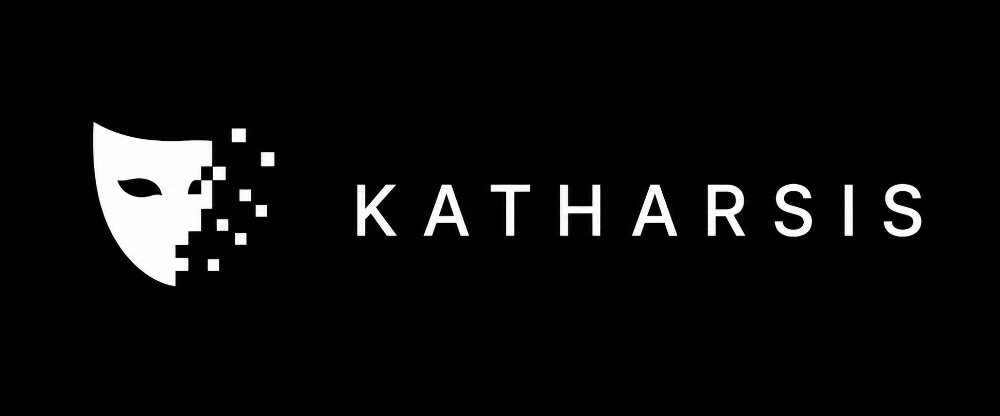

# Katharsis

  

**Status:** Active Development

> A Playwright-based browser automation project for inspecting, unsending, and testing Instagram message interactions through an existing Chrome session using the Chrome DevTools Protocol (CDP).

Last updated: 2026-08-31

---

# Project Overview

## What is this?

Katharsis is a browser automation project built with Python and Playwright that explores controlling an existing Chrome session through the Chrome DevTools Protocol (CDP).

The project focuses on understanding how modern web applications dynamically render content, manage interactive elements, and handle user actions through browser automation.

Katharsis currently supports:

- Connecting to an existing Chrome browser session
- Inspecting dynamic page structures and DOM elements
- Identifying message containers and scrollable regions
- Detecting available message actions
- Automating browser interactions through Playwright
- Testing reliable selectors against dynamically generated elements

## Tech Stack

- **Language:** Python 3.12
- **Browser Automation:** Playwright
- **Browser Integration:** Chrome DevTools Protocol (CDP)
- **Environment Management:** python-dotenv
- **Version Control:** Git

## Key Features

### Chrome Session Integration

- Connects to an already-running Chrome instance through CDP
- Uses the user's existing authenticated browser session
- Avoids storing login credentials or session cookies

### DOM Inspection & Reverse Engineering

- Analyzes dynamically generated page structures
- Identifies changing parent-child relationships
- Tests reliable selectors for automation workflows

### Message Automation Framework

- Scans visible messages
- Detects message ownership
- Locates available message actions
- Supports automated message interaction workflows

### Dynamic Scrolling

- Identifies scrollable containers automatically
- Navigates through dynamically loaded content
- Tests loading older message history

## Why was this built?

Modern websites are increasingly dynamic, relying heavily on JavaScript-generated content and changing DOM structures. Traditional automation methods often fail when elements are recreated or hidden behind interactive states.

Katharsis was created as a learning project to explore browser automation beyond simple scripting by understanding:

- How browsers expose automation interfaces
- How dynamic websites structure their content
- How reliable automation selectors are created
- How Playwright can interact with complex web applications

The project serves as a foundation for experimenting with browser automation, web scraping techniques, and future automation tooling.

## License

This project is source-available but **not open source**. Copyright (c)
2026 Stanley Chen - All Rights Reserved.

You may clone, fork, and run this project locally for personal, non-commercial
evaluation, testing, and code review. Commercial use, redistribution,
hosting as a service, and incorporation into other projects are not
permitted. See [LICENSE](LICENSE) for the full terms.
